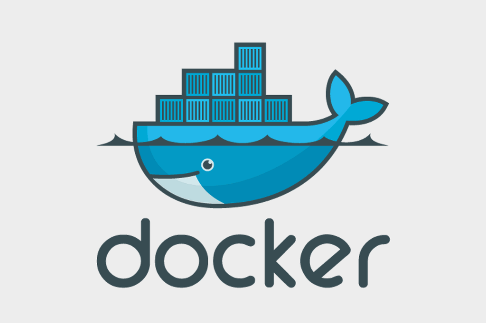

# softgrand-docker-mastery
Docker is a set of platform as a service products that uses OS-level virtualization to deliver software in packages called containers. Containers are isolated from one another and bundle their own software, libraries and configuration files; they can communicate with each other through well-defined channels.

Namespace :

Docker uses a technology called namespaces to provide the isolated work space called the container. When you run a container, Docker creates a set of namespaces for that container.

These namespaces provide a layer of isolation. Each aspect of a container runs in a separate namespace and its access is limited to that namespace.

Docker Engine uses namespaces such as the following on Linux:


    The pid namespace: Process isolation (PID: Process ID).
    The net namespace: Managing network interfaces (NET: Networking).
    The ipc namespace: Managing access to IPC resources (IPC: InterProcess Communication).
    The mnt namespace: Managing filesystem mount points (MNT: Mount).
    The uts namespace: Isolating kernel and version identifiers. (UTS: Unix Timesharing System).

Let see tool called nsenter which helps in accessing the container. nsenter is a small tool allowing to enter into namespaces. Technically, it can enter existing namespaces, or spawn a process into a new set of namespaces.

for example
```Dockerfile```
```
FROM python:alpine3.7
COPY . /app
WORKDIR /app
RUN pip install -r requirements.txt
EXPOSE 5000
CMD python ./index.py ```
```
      ``` how to build dockerfile in docker```
     docker build -t python-barcode .
          
```
how to using host network in docker
```
docker run --rm -d --network host --name my_nginx nginx


Let’s try nsenter, starting with the installation of this tool.

</img>
