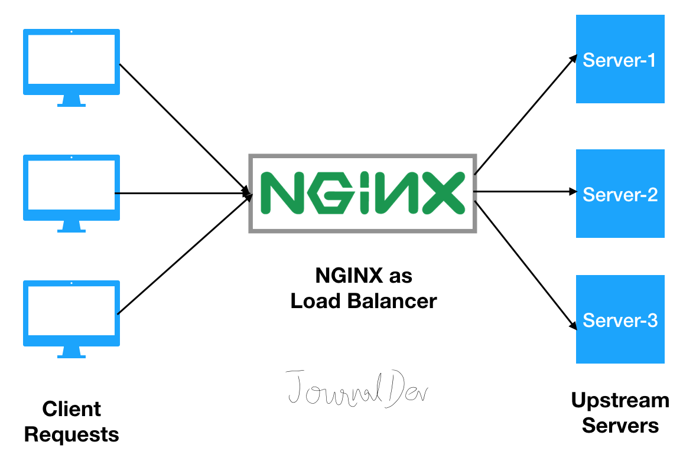

# softgrand-docker-mastery

### how to using host network in docker

docker network create mynet

### up container 

docker-compose up -d

### down container
docker-compose down

Let’s try nsenter, starting with the installation of this tool.

</img>
